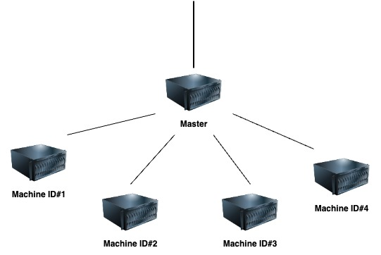
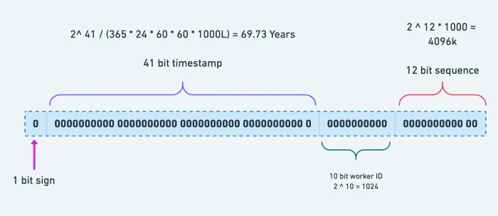

## Snowflake ID Generator in Go

This project is a simple implementation of Snowflake ID generator as a Go package.

### Snowflake ID

The Snowflake ID system was initially introduced by Twitter to generate unique tweet IDs. Currently, this format has been embraced by various companies such as Discord and Instagram. The Mastodon social network utilizes a modified version of the Snowflake ID system.

A Snowflake ID serves as a primary key, characterized by the following attributes:
- Uniqueness: Each ID is a unique 64-bit integer.
- Ordering: IDs are ordered based on their time of generation.
- Scalability: The ID generation process is designed to scale effectively, accommodating the demands of growing systems.

This scalable system provides a reliable and efficient means of uniquely identifying and ordering items. 
As demonstrated in the following diagram, ID generation is scalable. Each machine generates ID independently. 
The format described in the following ensures each ID is unique. In the following diagram master is responsible to dispatch request among machines.
Each machine can run an instance of this project configured correctly (Machines must have unique ID in a cluster).

---

### ID Format

The Snowflake ID is composed of four parts:
- **Sign:** 1 bit indicating the sign of the ID, with 1 representing a negative value.
- **Timestamp:** 41 bits in epoch format, starting from a predefined origin. 
Represents the time when the ID was generated, providing ordering by time.
- **Machine ID:** 10 bits to uniquely identify each machine in a cluster and ensuring unique ID generation among machines.
- **Sequence ID:** 12 bits. Starts from a specified initial value and increments by one.

---

### Limitations

- The running time is limited (about 70 years). 
- Number of machines is limited to 1024
- After 4097k count, the sequence generator should be restarted. 

---

### Comparison to other techniques

1. Database sequence generator
2. UUID

---

### TODO List
- Atomicity in Generate function.
- Unit tests
- Make file 
- Update documentation

---

**References:**

- [Snowflake ID on Wikipedia](https://en.wikipedia.org/wiki/Snowflake_ID)
- [Announcing Snowflake](https://blog.twitter.com/engineering/en_us/a/2010/announcing-snowflake)
- [Twitter snowflake approach is cool](https://keeplearning.dev/twitter-snowflake-approach-is-cool-3156f78017cb)

